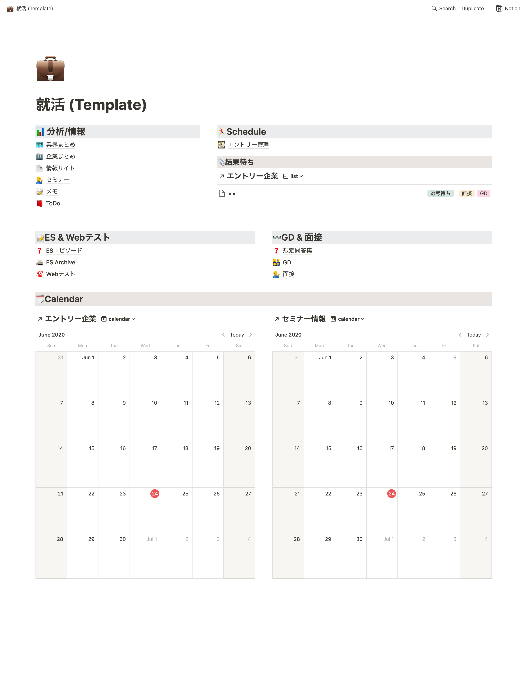
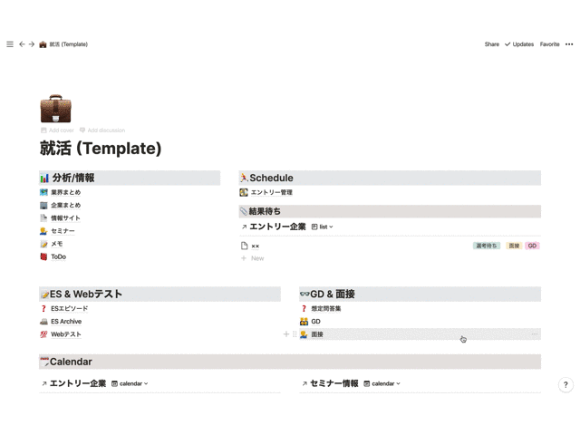

# [notion-job-hunt](https://www.notion.so/Template-b7c3a06cac234d5888e0264af1661ce8)

Schedule management by Notion in job hunting

## Appearance

<!--  -->

## Install

Please click ``duplicate`` button.

<!--  -->

## Usage

### 1. Add a company

企業まとめ → 企業追加

<!--  -->
